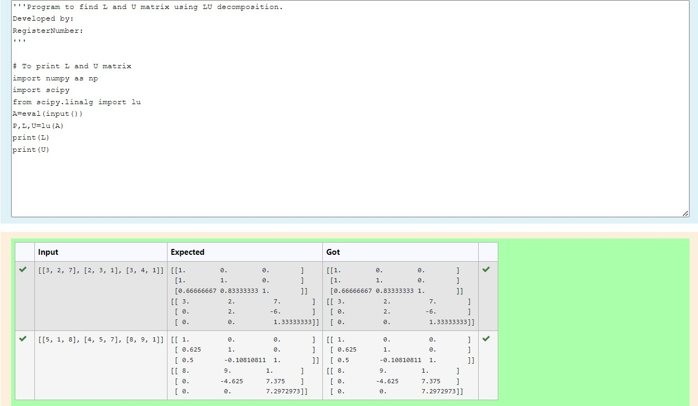
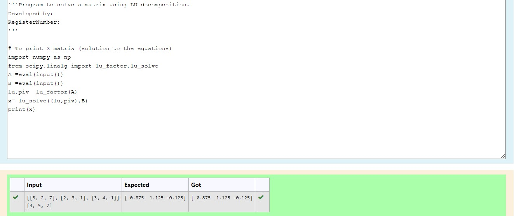

# LU Decomposition without zero on the diagonal

## AIM:
To write a program to find the LU Decomposition of a matrix.

## Equipments Required:
1. Hardware – PCs
2. Anaconda – Python 3.7 Installation / Moodle-Code Runner

## Algorithm
1. Import numpy library using import statement.
2. From scipy package import lu().
3. Get input from user and pass it as an array.
4. Get P, L U martix using lu().
5. Print L and U matrix.
## Program:
```

Program to find the LU Decomposition of a matrix.
Developed by: Parshwanath M
RegisterNumber: 21002544

1.LU Decomposition to find L and U matrix.

# To print L and U matrix
import numpy as np
import scipy
from scipy.linalg import lu
A=eval(input())
P,L,U=lu(A)
print(L)
print(U)


2.Program to solve a matrix using LU decomposition

# To print X matrix (solution to the equations)
import numpy as np
from scipy.linalg import lu_factor,lu_solve
A =eval(input())
B =eval(input())
lu,piv= lu_factor(A)
x= lu_solve((lu,piv),B)
print(x)

```

## Output:



## Result:
Thus the program to find the LU Decomposition of a matrix is written and verified using python programming.

